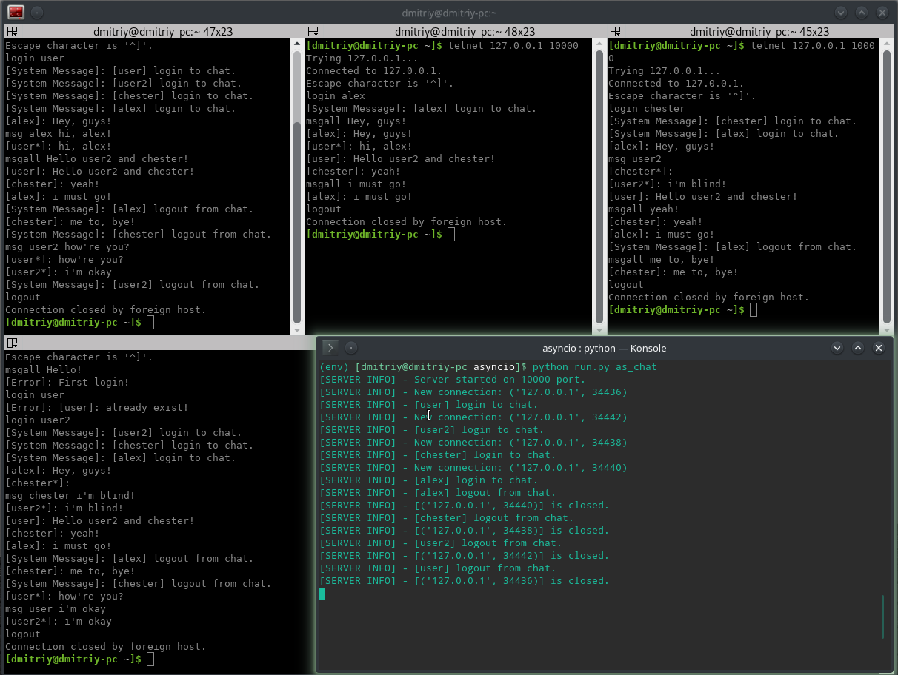

# Asyncio, twisted, tornado #

Подготовка:

1) git clone https://github.com/dimadeck/async

2) cd async

3) python -m venv env

4) source env/bin/activate

Note [10.09.18]:

Реализация асинхронного сервера инструментами Asyncio и Twisted.

Подключение клиентов через telnet:

Twisted: port = 1234

Asyncio: port = 10000

## Asyncio Simple Chat ##

Запуск сервера:

python run.py as_chat

Клиенты: telnet 127.0.0.1 10000

Демонстрация работы чата:

## Twisted Simple Chat ##

Запуск сервера:

python run.py tw_chat

Клиенты: telnet 127.0.0.1 1234

Демонстрация работы чата:

