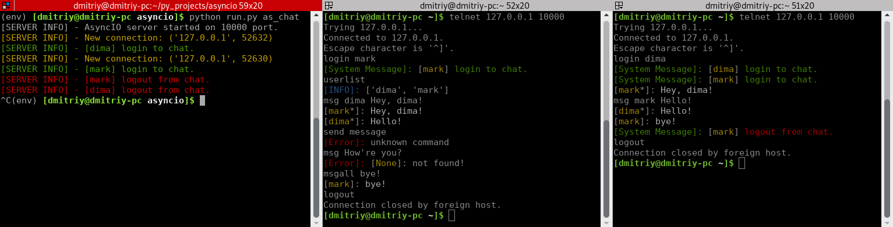
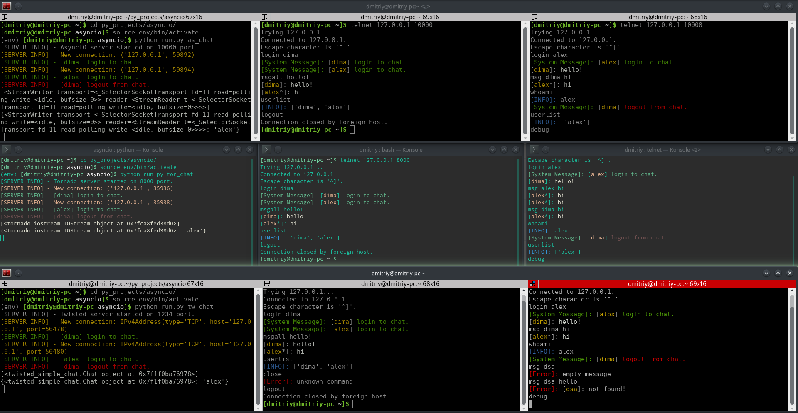
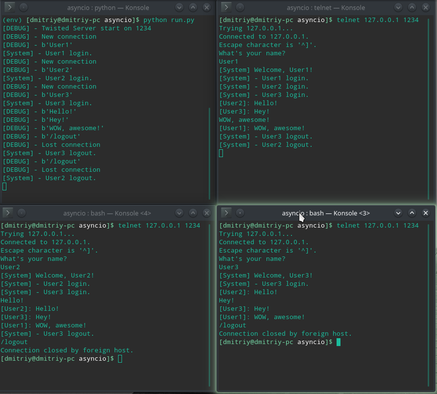

# Asyncio, twisted, tornado #

Подготовка:

1) git clone https://github.com/dimadeck/async

2) cd async

3) python -m venv env

4) source env/bin/activate

## Note [13.08.18]: ##

### Update ###
Добавлен цвет сообщений для более комфортного просмотра сообщений.

Реализация асинхронного сервера с помощью инструментов Asyncio, Tornado и Twisted.

{asyncio, tornado, twisted}*_simple_chat.py - Наследники класса ChatKernel. В нем основная логика чата и его механизмы:
подключенные пользователи, парсинг данных и т.д.

Демонстрация работы трех чатов:

Подключение клиентов через telnet:

Twisted: port = 1234

Asyncio: port = 10000

Tornado: port = 8000

## Tornado Simple Chat ##

Запуск сервера:

python run.py tor_chat

Клиенты: telnet 127.0.0.1 8000

Демонстрация работы чата:

## Asyncio Simple Chat ##

Запуск сервера:

python run.py as_chat

Клиенты: telnet 127.0.0.1 10000

Демонстрация работы чата:

## Twisted Simple Chat ##

Запуск сервера:

python run.py tw_chat

Клиенты: telnet 127.0.0.1 1234

Демонстрация работы чата:

