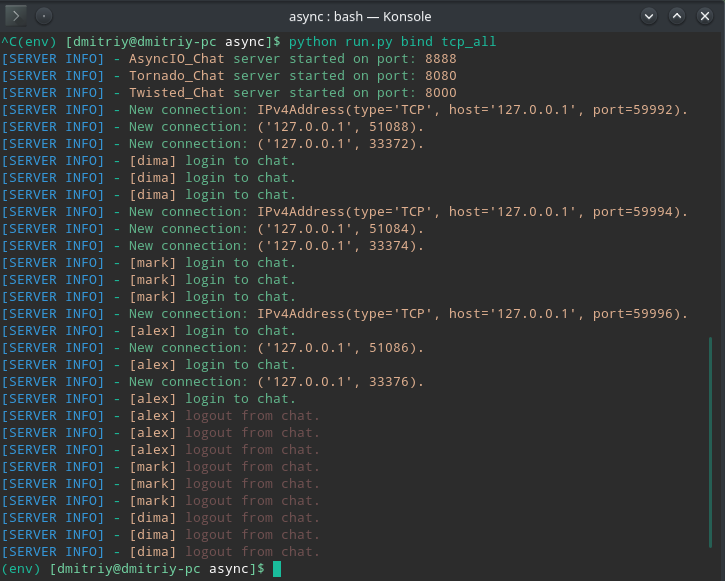
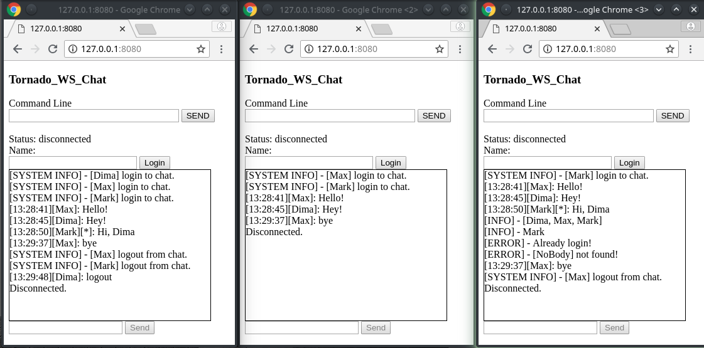
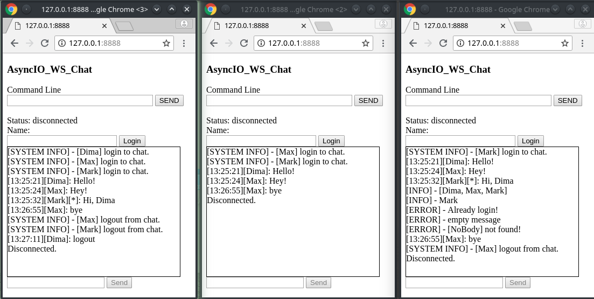
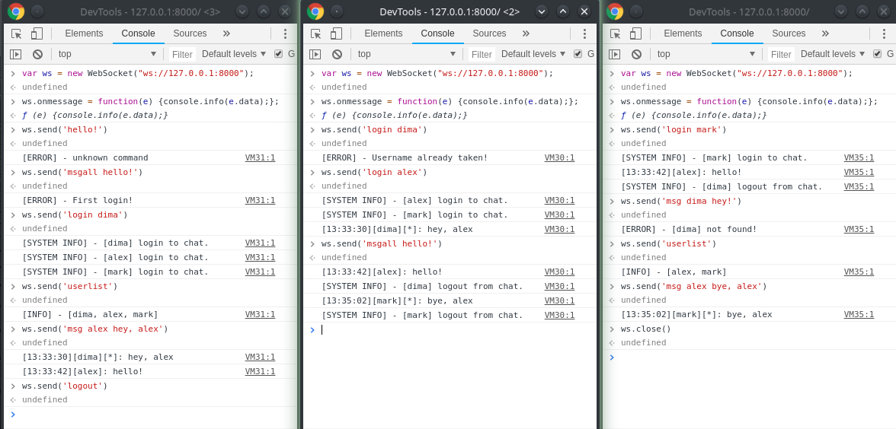
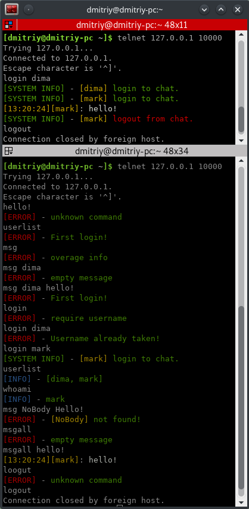

# Chats #
## AsyncIO, Twisted, Tornado ##

    Подготовка:

        git clone https://github.com/dimadeck/async_chat
        cd async_chat
        python -m venv env
        source env/bin/activate
        pip install -r requirements.txt

## Note [24.08.18]: ##

    Описание проекта:

    Реализация асинхронных TCP и WebSocket чатов с помощью библиотек AsyncIO, Twisted, Tornado.

    Подключенные модули:

    Run modules:

        - Run - запуск проекта или его частей производится с помощью этого модуля.

            Синтаксис:

            python run.py [program]
            [program] = ['as_chat', 'tor_chat', 'tw_chat', 'bind',
                        'aio_ws_chat', 'tor_ws_chat', 'tw_ws_chat']

        - Bind - параллельный запуск серверов.

            Синтаксис:

            python run.py bind [bind_program]
            [bind_program] = ['as', 'tor', 'tw', 'tcp_all', 'ws_all']

    Kernel modules:

        - ChatKernel - ядро чата, на вход поступает команда, обрабатывается, и выполняется
        необходимое действие.

        - DataParser - разбор приходящей на сервер команды. На этом уровне происходит
        валидация данных (синтаксис).

        - Connected - модуль отвечает за хранение информации о подключениях и
        зарегистрированных пользователях.

        - ChatProtocol - связь приходящих на сервер команд и необходимых дейтствий
        в ответ на эти команды.

            - login <username> - регистрация пользователя;
            - msg <username> <message> - отправить сообщение
                message пользователю username;
            - msgall <message> - отправить сообщение message
                всем зарегистрированным пользователям;
            - logout - выход пользователя из чата;
            - whoami - узнать свое имя;
            - userlist - узнать имена всех пользователей;

        - ChatPackMessage - упаковщик сообщений, отвечает за информацию, отображаемую
        в окне терминала сервера, и ответы клиентам (системные сообщения, чат).

            Формат ответа:
            - '[Suffix] - Message'
            - '[TimeStamp][username][private]: Message'

        - ColorModule - модуль для добавления цвета тексту, отображаемого в окне сервера
        и тексту ответов клиентам. Подключен только к TCP чату. Используется на уровне упаковщика.

        - ForkChatKernel - Наследник модуля ChatKernel, изменены некоторые функции на async/await
        для AsyncIO чатов (TCP + WebSocket).

    Chat modules:

    Серверы, реализующие работу ChatKernel(прием и отправка данных), используя различные модули.

        TCP:
        - AsyncIO - Модули: asyncio, loop, async/await;
        - Tornado - Модули: tornado, ioloop, tcp_server;
        - Twisted - Модули: twisted, lineReceiver, reactor, factory, protocol;

        WebSocket:
        - AsyncIO - Модули: aiohttp, aiohttp.web, application, jinja2;
        - Tornado - Модули: tornado, tornado.web, tornado.websocket;
        - Twisted - Модули: WebSocketServerProtocol, WebSocketServerFactory

    ## Демонстрация работы ##

    ### TCP ###

    Клиенты:

        Подключение:
        telnet 127.0.0.1 port

    Серверы:

    ### WebSocket ###

    Tornado_WS и AsyncIO_WS - при подключении к серверу через браузер возвращает html-страницу с js.
    Пользователю предлагается альтернатива ввода данных. Вверху страницы командная строка для ввода
    "чистых" команд (по протоколу). Внизу строка ввода сообщения, которое получат все (аналог msgall)

    Tornado_WS:

    AsyncIO_WS:

    Twisted_WS:

    Подключен протокол к twisted_websocket, однако на данном этапе "общение" возможно только через консоль
    разработчика в браузере.

    Как пользоваться:

        python run.py tw_ws_chat

        В браузере в консоли разработчика(F12 -> Console) вводить:

        var ws = new WebSocket("ws://127.0.0.1:1234");
        ws.onmessage = function(e) {console.info(e.data);};
        ws.send('<message>');

        <message> - сообщение по протоколу

        Первая строчка - создание объекта WS. В этот момент в терминале сервера отобразится надпись 'open'.
        Вторая строчка - для отображения входящего сообщения в консоли
        Третья строчка - отправка сообщения. При отправке сообщения, для правильной работы чата, следует
        соблюдать протокол. В случае ошибочного запроса сервер в ответном сообщении укажет на ошибку
        (bad request,syntax error, auth error, etc)

    ### Примеры ошибочных запросов ###

