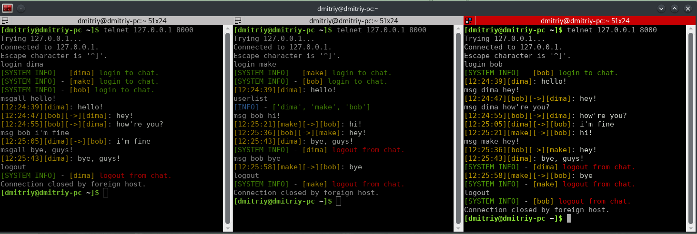
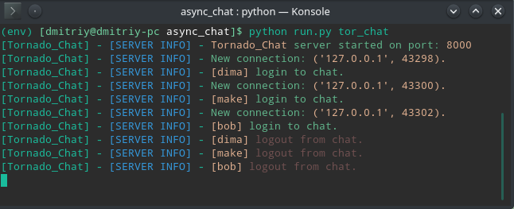
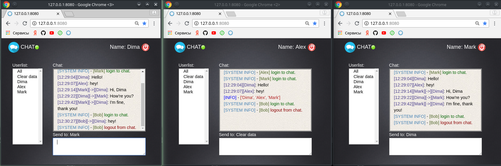
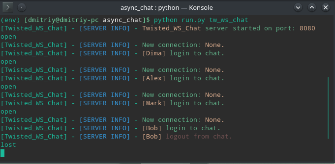
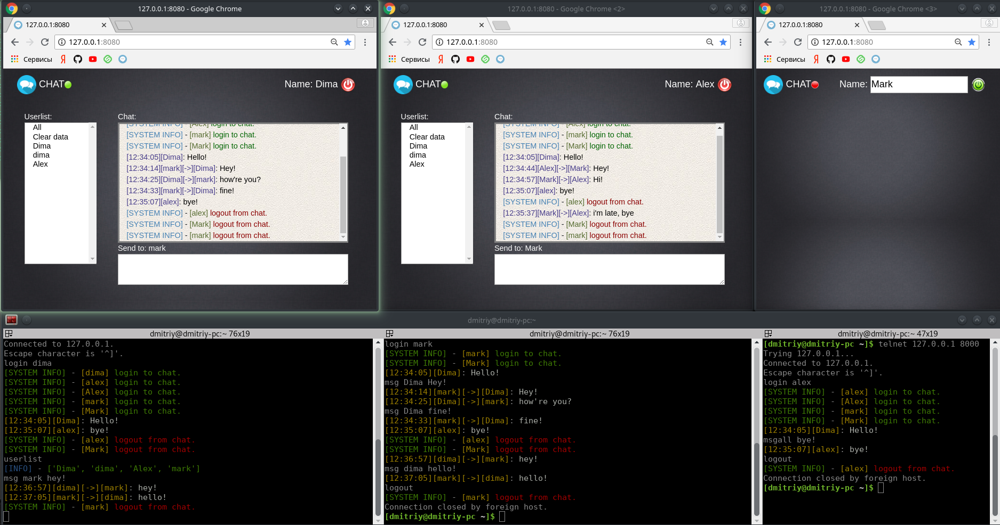
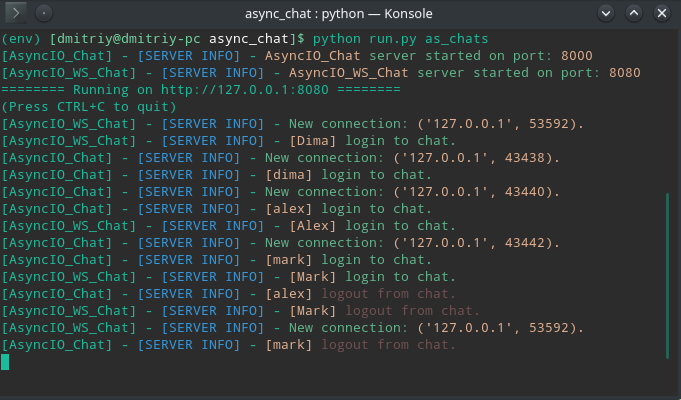

# Chats #

## AsyncIO, Twisted, Tornado ##

    Подготовка:

        git clone https://github.com/dimadeck/async_chat
        cd async_chat
        python -m venv env
        source env/bin/activate
        pip install -r requirements.txt

### [Release v.0.5] ###
    https://github.com/dimadeck/async_chat/tree/stable_version_0.5 
    
    What's new:
    Исправлены некоторые ошибки и недочеты
      Сбои при отключении AsyncIO_ws, tornado
    Выделена сущность Sender для работы с подключениями и серверами
    Оптимизирован ChatKernel:
      убраны Outer functions, 
      перенесены функций в более подходящие модули
    Добавлены тесты для Kernel модулей (запуск с рекурсивным поиском по проекту)
    Изменена архитектура html файла (выделены js, css, images)
    Адаптация серверов под новую архитектуру html
    ColorModule в PackMessage используется только для логгирования сервера, 
      добавление цвета сообщениям происходит непосредственно перед отправкой.
    
## [Release v.0.4] ##   
    https://github.com/dimadeck/async_chat/tree/stable_version_0.4 
  
## [Описание проекта]: ##
    Реализация асинхронных TCP и WebSocket чатов с помощью библиотек AsyncIO, Twisted, Tornado.

    Run modules:
        - Run - запуск проекта или его частей производится с помощью этого модуля.
            Синтаксис:
            python run.py [program]
            ['as_chat', 'tor_chat', 'tw_chat'] - TCP VERSIONS
            ['aio_ws_chat', 'tor_ws_chat', 'tw_ws_chat'] - WebSocket VERSIONS
            ['as_chats', 'tor_chats', 'tw_chats'] - pair VERSIONS
            ['test'] - Запуск тестов

    Kernel modules:
        - ChatKernel - ядро чата, на вход поступает команда, обрабатывается, и выполняется
        необходимое действие.

        - Sender - модуль для работы с подключениями (Connection Manager) 
        и конечными серверами (вызываются методы отправки сообщений и закрытия соединений).

        - DataParser - разбор приходящей на сервер команды. На этом уровне происходит
        валидация данных (синтаксис).

        - Connected - модуль отвечает за хранение информации о подключениях и
        зарегистрированных пользователях.

        - ChatProtocol - связь приходящих на сервер команд и необходимых действий
        в ответ на эти команды.

        - ChatPackMessage - упаковщик сообщений, отвечает за информацию, отображаемую
        в окне терминала сервера, и ответы клиентам (системные сообщения, чат).
            Формат ответа:
            - '[Suffix] - Message'
            - '[TimeStamp][username][private][target]: Message'

        - ColorModule - модуль для добавления цвета тексту, отображаемого в окне сервера
        и тексту ответов клиентам. Используется перед непосредственной отправки сообщения. 
        Для WS клиентов модуль оборачивает сообщение в html разметку.

        - ForkChatKernel - Наследник модуля ChatKernel, изменены некоторые функции на async/await
        для AsyncIO чатов (TCP + WebSocket).

    Server modules:
      Серверы, реализующие работу ChatKernel(прием и отправка данных), 
      используя различные модули.

        TCP:
        - asyncIO - Модули: asyncio, loop, async/await;
        - tornado - Модули: tornado, ioloop, tcp_server;
        - twisted - Модули: twisted, lineReceiver, reactor, factory, protocol;

        WebSocket:
        - asyncIO_ws - Модули: aiohttp, aiohttp.web, application, jinja2;
        - tornado_ws - Модули: tornado, tornado.web, tornado.websocket;
        - twisted_ws - Модули: WebSocketServerProtocol, WebSocketServerFactory

    Test modules:
      Тесты для проверки большинства функций модулей: 
        [Connected, DataParser, Kernel, PackMessage, Protocol, Sender]
      Проверка определяет правильность реагирования модулей на поступающие данные
      (как правильные так и ошибочные).
      
      Запуск:
        python run.py test

    Протокол общения:
        - login <username> - регистрация пользователя;
        - msg <username> <message> - отправить сообщение
            message пользователю username;
        - msgall <message> - отправить сообщение message
            всем зарегистрированным пользователям;
        - logout - выход пользователя из чата;
        - whoami - узнать свое имя;
        - userlist - узнать имена всех пользователей;
        
        -/userlist и /whoami для получения ответа в обход упаковщика. 
        Используется для заполнения списка пользователей в веб-интерфейсе.

## [Демонстрация работы] ##

    TCP (на примере tornado):
        Запуск сервера: 
            python run.py tor_chat
        Подключение:
            telnet 127.0.0.1 8000
    

    WebSocket (на примере twisted_ws):
        Запуск сервера:
            python run.py tw_ws_chat
        Подключение:
            Перейти в браузере на 127.0.0.1:8080

    TCP + WebSocket (на примере asyncIO_pair)
        Запуск сервера:
            python run.py as_chats
        Подключение:
            telnet 127.0.0.1 8000 - для TCP
            Перейти в браузере на 127.0.0.1:8080 - для WebSocket

### Примеры обработки ошибочных запросов ###

  