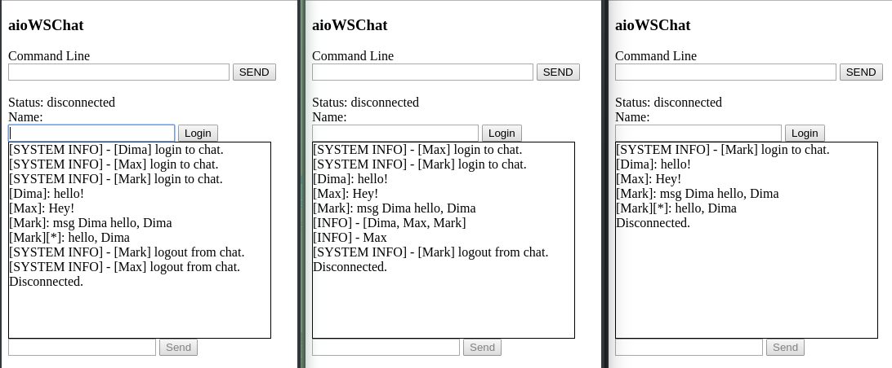
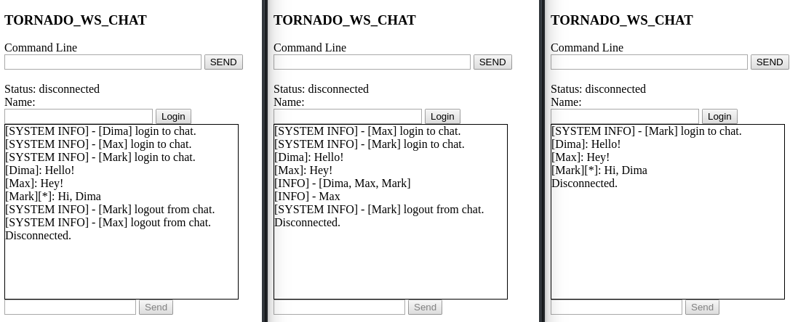
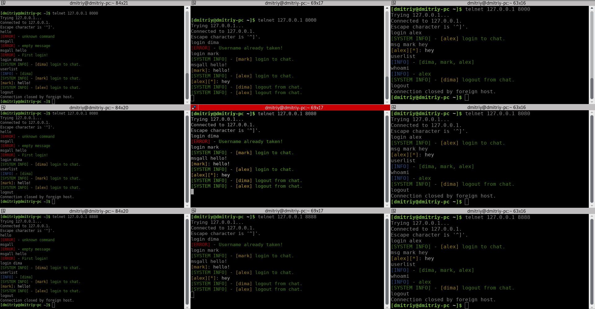
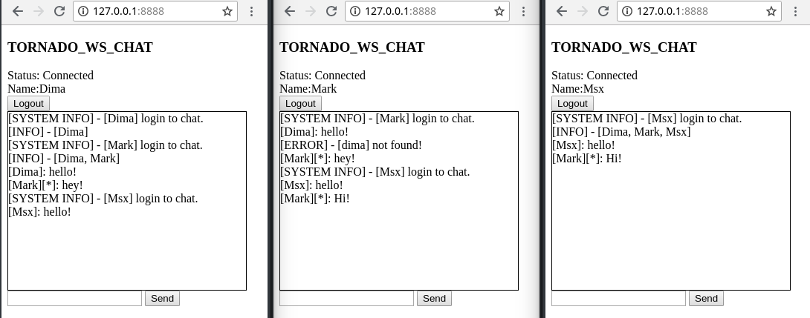
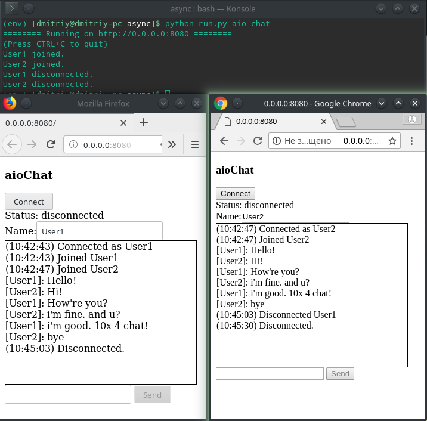

# Asyncio, twisted, tornado #

    Подготовка:

        git clone https://github.com/dimadeck/async
        cd async
        python -m venv env
        source env/bin/activate
        pip install -r requirements.txt

## Note [23.08.18]: ##
    Подключен протокол к aiohttp_web, основанный на форке ChatKernel (некоторые функции теперь async/await)

Aiohttp WebSocket Chat:

Tornado WebSocket Chat:

## Note [22.08.18]: ##

Состояние проекта:

    Работают правильно, по протоколу(основанные на ChatKernel):

        AsyncIO_chat, Twisted_chat, Tornado_chat

        Запуск:

        python run.py [program]

        program = {as_chat, tw_chat, tor_chat}
        или
        program = {bind tcp_all} для параллельного запуска трех серверов
        В логах будут написаны порты для подключения клиентов через telnet:

        telnet 127.0.0.1 port

    Требуют доработки:
        - Tornado_web - подключен к протоколу, сервер способен выдавать html-страницу с чатом пользователю,
    общаться с сервером теми же командами, что и в TCP-чате. Требуется добавить альтернативный IO для общения с
    сервером (автоматическое, командная строка)

        Запуск сервера:
        -python run.py aio_chat

        Запуск клиента:
            В браузере 127.0.0.1:port

        - aiohttp_web - работает на основе прошлого ядра, не подключен к общему протоколу.

        - twisted_ws - разрабатывается, подключаться к серверу можно только через командную строку браузера, не выдает страницу html в ответ.

Переписаны модули:
    ChatKernel - Ядро чата - теперь и tcp_socket и web_socket наследуются от ChatKernel.
Cвязывает модули: Connected, ChatProtocol, ChatPackMessage. Принимает команду, обрабатывает, отправляет клиентам.

    ChatPackMessage - упаковщик сообщений, весь текст ответа формируется в нем.

    ChatColor - добавление цвета тексту ответа от упаковщика.

Добавлены модули:
    ChatProtocol - связывает полученную команду с функцией и аргументами и инициализирует ее выполнение.

Демонстрация работы:

Параллельный запуск трех серверов:

Одинаковое поведение клиентов вне зависимости от версии tcp-чата:

Tornado_Web_Socket:

aiohttp_Web_Socket:

## END Note [22.08.18]: ##

## Note [15.08.18]: ##

Реализован простой websocket чат на основе aiohttp:

## Note [13.08.18]: ##

### Update ###
Добавлен цвет сообщений для более комфортного просмотра сообщений.

Реализация асинхронного сервера с помощью инструментов Asyncio, Tornado и Twisted.

{asyncio, tornado, twisted}*_simple_chat.py - Наследники класса ChatKernel. В нем основная логика чата и его механизмы:
подключенные пользователи, парсинг данных и т.д.

Демонстрация работы трех чатов:

Подключение клиентов через telnet:

Twisted: port = 1234

Asyncio: port = 10000

Tornado: port = 8000

## Tornado Simple Chat ##

Запуск сервера:

python run.py tor_chat

Клиенты: telnet 127.0.0.1 8000

Демонстрация работы чата:

## Asyncio Simple Chat ##

Запуск сервера:

python run.py as_chat

Клиенты: telnet 127.0.0.1 10000

Демонстрация работы чата:

## Twisted Simple Chat ##

Запуск сервера:

python run.py tw_chat

Клиенты: telnet 127.0.0.1 1234

Демонстрация работы чата:

